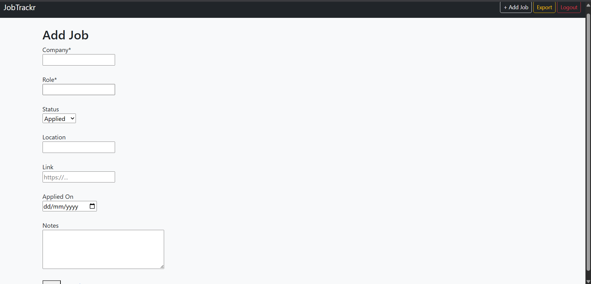
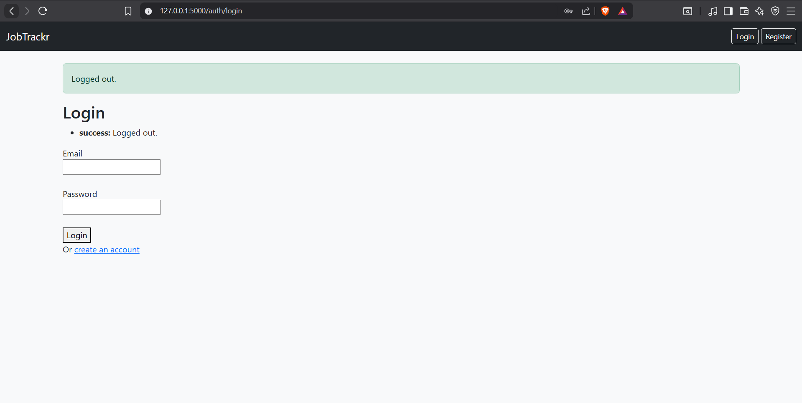

A simple yet powerful **Job Application Tracker** built with **Flask + SQLAlchemy + Bootstrap + Chart.js**.  
Easily register, log in, and manage your job applications with a clean dashboard, filters, and visualizations.  

## 🚀 Features

- 🔐 **User Authentication**  
  - Register, Login, Logout (passwords securely hashed with Werkzeug).  

- 📂 **Job CRUD**  
  - Add, edit, delete, and list your job applications.  

- 🔎 **Smart Dashboard**  
  - Filters by **status**, **keyword search**, and **application month**.  
  - Pagination for large job lists.  

- 📊 **Analytics & Visualization**  
  - Status breakdown pie chart.  
  - Applications per month bar chart.  
  - Summary counters (Applied / Interview / Offer / Rejected).  
  - Quick interview/offer rates.  

- 📥 **Data Export**  
  - Export all your jobs to CSV for Excel/Google Sheets.  

- 🎨 **Modern UI**  
  - Styled with Bootstrap 5.  
  - Responsive layout, clean tables, flash messages.  

---

## 🛠️ Tech Stack

- [Flask](https://flask.palletsprojects.com/) (Python web framework)  
- [Flask-Login](https://flask-login.readthedocs.io/) (authentication/session management)  
- [Flask-Migrate](https://flask-migrate.readthedocs.io/) + SQLAlchemy (ORM + migrations)  
- [Bootstrap 5](https://getbootstrap.com/) (frontend styling)  
- [Chart.js](https://www.chartjs.org/) (charts & data visualization)  
- SQLite (default database, easy to run locally)  

---

## ⚙️ Setup & Installation

```bash
# 1. Clone the repo
git clone https://github.com/YOUR-USERNAME/jobtrackr.git
cd jobtrackr

# 2. Create virtual environment
python3 -m venv .venv
source .venv/bin/activate   # Linux/Mac
.venv\Scripts\activate      # Windows

# 3. Install dependencies
pip install -r requirements.txt

# 4. Set environment variables (create .env file)
# .env
FLASK_APP=app
FLASK_ENV=development
SECRET_KEY=your-secret-key

# 5. Run migrations
flask --app app db upgrade

# 6. Start the app
flask --app app run --debug
```

Visit: http://127.0.0.1:5000

---

## 📸 Screenshots

### Dashboard with Filters + Charts


### Add Job Form


### Login Form


### Register Form


---

## 📂 Project Structure
``` csharp
jobtrackr/    
├── app.py                         # Flask entrypoint    
├── config.py                      # App configuration    
├── extensions.py                  # db, migrate, login_manager    
├── models.py                      # SQLAlchemy models    
├── routes/                        # Blueprints (auth, jobs, main)      
├── templates/                     # HTML templates (Jinja2)    
├── static/                        # Static files    
├── requirements.txt               # Dependencies    
├── Procfile                       # (for deployment)    
└── README.md               
```
---

## 🧭 Future Ideas

- Deploy online.                       ☑️

- Add email reminders for interviews.

- Multi-user sharing / teams.

- Dark mode.

- Switch to PostgreSQL for production
  
- Add job reminders / follow-up notifications

- More analytics (time-to-offer, conversion rates)

- User profile customization
